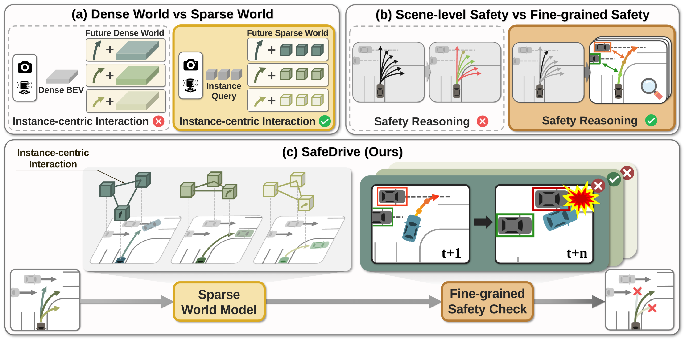
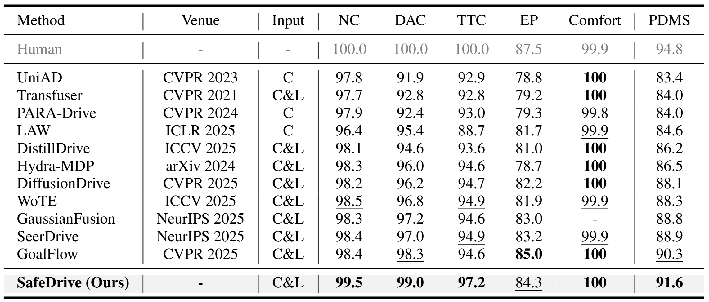

<div align="center">   
<br><br>
  
# SafeDrive: Fine-Grained Safety Reasoning for End-to-End Driving in a Sparse World

[**Jungho Kim**](https://scholar.google.com/citations?user=9wVmZ5kAAAAJ&hl=ko), **Jiyong Oh**, [**Seunghoon Yu**](https://scholar.google.com/citations?user=RJnWLIUAAAAJ&hl=ko&authuser=1&oi=ao), **Hongjae Shin**, **Donghyuk Kwak**, [**Jun Won Choi**](https://scholar.google.com/citations?user=IHH2PyYAAAAJ&hl=ko&oi=ao)  


### **Seoul National University, ADR Lab**

### **CVPR 2026 Highlight**

[](https://arxiv.org/abs/2602.18887)
[](https://spa-junghokim.github.io/SafeDrive-Page/)


</div>


## 🔔 News
- [2026/04]: SafeDrive is awarded as CVPR 2026 Highlight! ⭐
- [2026/03]: We will release the full code & checkpoints of SafeDrive.
- [2026/02]: SafeDrive is accepted at CVPR 2026! 🔥
</br>


## 📽️ Framework
<p align="center">

</p>

**Comparison of end-to-end planning paradigms and the SafeDrive framework.** (a) Dense world models provide limited modeling of instance-centric interactions, whereas sparse world models capture them effectively. (b) Scene-level safety evaluation is coarse, while fine-grained evaluation identifies the specific agents and timestamps associated with potential risks. (c) SafeDrive leverages a sparse world model and fine-grained safety reasoning to generate safe trajectories.

## ⚡ Main Result
<p align="center">

</p>

## 📃 Bibtex

If you find this work useful for your research or projects, please consider citing the following BibTeX entry.

```
@inproceedings{safedrive,
  title={SafeDrive: Fine-Grained Safety Reasoning for End-to-End Driving in a Sparse World},
  author={Kim, Jungho and Oh, Jiyong and Yu, Seunghoon and Shin, Hongjae and Kwak, Donghyuk and Choi, Jun Won},
  booktitle={Proceedings of the IEEE/CVF Conference on Computer Vision and Pattern Recognition},
  year={2026}
}
```

## 🙏 Acknowledgement

This project builds upon several outstanding open-source projects. We gratefully acknowledge the following key contributions.

- [NAVSIM](https://github.com/autonomousvision/navsim), [DiffusionDrive](https://github.com/hustvl/DiffusionDrive), [WoTE](https://github.com/liyingyanUCAS/WoTE), [BEVFormer](https://github.com/fundamentalvision/BEVFormer), [GTRS](https://github.com/NVlabs/GTRS), [iPad](https://github.com/Kguo-cs/iPad)
