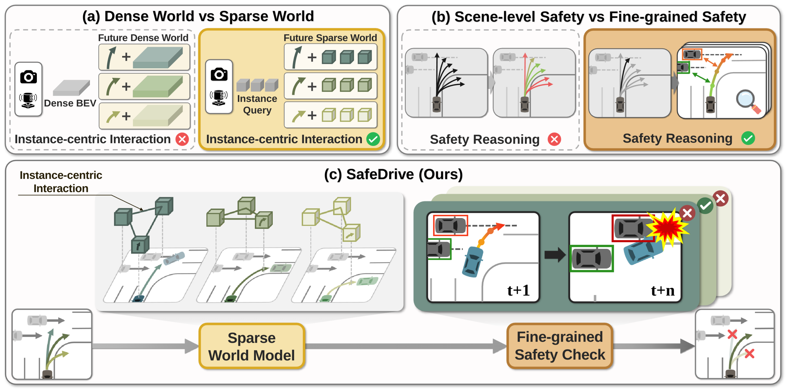

<div align="center">
<br><br>

# SafeDrive: Fine-Grained Safety Reasoning for End-to-End Driving in a Sparse World

[**Jungho Kim**](https://scholar.google.com/citations?user=9wVmZ5kAAAAJ&hl=ko), **Jiyong Oh**, [**Seunghoon Yu**](https://scholar.google.com/citations?user=RJnWLIUAAAAJ&hl=ko&authuser=1&oi=ao), **Hongjae Shin**, **Donghyuk Kwak**, [**Jun Won Choi**](https://scholar.google.com/citations?user=IHH2PyYAAAAJ&hl=ko&oi=ao)

#### **Seoul National University, ADR Lab**

### **CVPR 2026 Highlight**

[](https://arxiv.org/abs/2602.18887)
[](https://spa-junghokim.github.io/SafeDrive-Page/)

</div>

## 🔔 News
- [2026/08]: Code and checkpoints are released! 🚀
- [2026/04]: SafeDrive is awarded as CVPR 2026 Highlight! ⭐
- [2026/02]: SafeDrive is accepted at CVPR 2026! 🔥

## 📽️ Framework

<div align="center">

</div>

| Stage | What it does |
| --- | --- |
| **ProposalNet** | BEV encoding, object detection, and the initial trajectory proposals |
| **SWNet** | filters the instances and runs the joint motion / plan decoder |
| **FRNet** | fine-grained safety: scene-level scores, pair-wise no-collision, time-wise drivable-area compliance |

Safety supervision comes from rolling the model's own plans through the PDM
simulator during training (`EPDMS Score`).

## 📊 Main Result

NAVSIM **navtest** (12,146 scenarios). All rows are the numbers reported in the
paper, plus our reproduction of SafeDrive from this repository.

| Method | NC | DAC | TTC | EP | Comf. | PDMS |
| :--- | :---: | :---: | :---: | :---: | :---: | :---: |
| Transfuser | 97.7 | 92.8 | 92.8 | 79.2 | 100 | 84.0 |
| Hydra-MDP | 98.3 | 96.0 | 94.6 | 78.7 | 100 | 86.5 |
| DiffusionDrive | 98.2 | 96.2 | 94.7 | 82.2 | 100 | 88.1 |
| WoTE | 98.5 | 96.8 | 94.9 | 81.9 | 99.9 | 88.3 |
| **SafeDrive** | **99.5** | **99.0** | **97.2** | **84.3** | 100 | **91.6** |
| **SafeDrive\*** | 99.5 | 98.8 | 97.1 | 84.8 | 99.5 | **91.6** |

\* reproduced with this release: `test.sh` with the shipped phase 3 checkpoint
and score weights (DDC 97.8, not a PDMS component).


## ⚡ Getting Started

- [Environment preparation](docs/install.md)
- [Preprocessing](docs/preprocess.md)
- [Training and evaluation](docs/train_eval.md)

```bash
bash cache.sh    # feature cache + metric caches, once
bash train.sh    # phase 1 -> phase 2 -> phase 3
bash test.sh     # navtest forward + PDM scoring
```

Each script keeps every setting in one configuration block at the top; edit them
in place rather than passing environment variables.

| Phase | Agent config | Role |
| --- | --- | --- |
| 1 | `SafeDrive_Phase1_Perception` | perception pretraining, no planning head |
| 2 | `SafeDrive_Phase2_Planner_FreezePerception` | planner and safety heads on frozen perception |
| 3 | `SafeDrive_Phase3_Planner_FullTrain` | end-to-end fine-tune (main config) |

The 256 planning anchors ship as
`trajectory_anchors/trajectory_anchors_256_GTRS.npy`, and
[`make_anchors.sh`](make_anchors.sh) rebuilds them by k-means over the navtrain
ground-truth trajectories.


## 🏋️ Checkpoints

Download and place under `ckpts/`. 

| Checkpoint | Training | GDrive |
| :--- | :--- | :---: |
| `safedrive_phase1_90ep.ckpt` | perception only | [Link](https://drive.google.com/file/d/1pvxMcWBVNLyruL3h2-4LT8yznOufieXg/view?usp=drive_link) |
| `safedrive_phase2_5ep.ckpt` | perception freeze | [Link](https://drive.google.com/file/d/12puIwoj7r3NWwqr83sPgk9Bmqxkwce0T/view?usp=drive_link) |
| `safedrive_phase3_10ep.ckpt` | full training | [Link](https://drive.google.com/file/d/15oLu8JxJZcS8g8taFUrqSd23Npz3UxUA/view?usp=drive_link) |


## 📃 Bibtex

```bibtex
@inproceedings{safedrive,
  title={SafeDrive: Fine-Grained Safety Reasoning for End-to-End Driving in a Sparse World},
  author={Kim, Jungho and Oh, Jiyong and Yu, Seunghoon and Shin, Hongjae and Kwak, Donghyuk and Choi, Jun Won},
  booktitle={Proceedings of the IEEE/CVF Conference on Computer Vision and Pattern Recognition},
  year={2026}
}
```

## 📄 License

Released under the [MIT License](LICENSE).

## 🙏 Acknowledgement

This project builds upon several outstanding open-source projects.

- [NAVSIM](https://github.com/autonomousvision/navsim), [DiffusionDrive](https://github.com/hustvl/DiffusionDrive), [WoTE](https://github.com/liyingyanUCAS/WoTE), [BEVFormer](https://github.com/fundamentalvision/BEVFormer), [GTRS](https://github.com/NVlabs/GTRS), [iPad](https://github.com/Kguo-cs/iPad)
